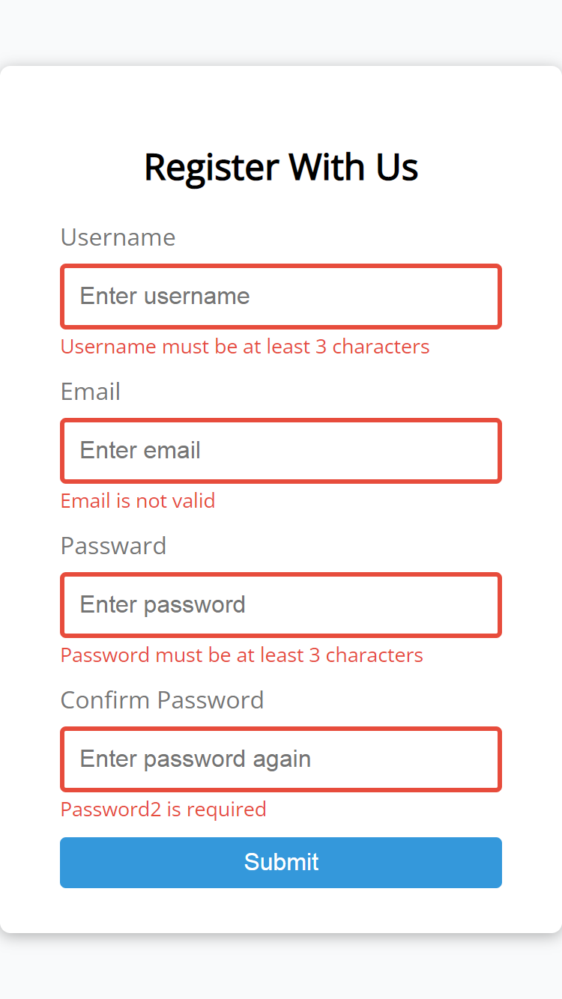

# form-validation
Simple client side form validation. Check requird, length, email and password match

## Project Specifications

- Create form UI
- Show error messages under specific inputs
- checkRequired() to accept array of inputs
- checkLength() to check min and max length
- checkEmail() to validate email with regex
- checkPasswordsMatch() to match confirm password

Check the Live Demo of form-validator here :
<a href = "https://shubhamjaiswal23.github.io/form-validation/">form-validation</a>
